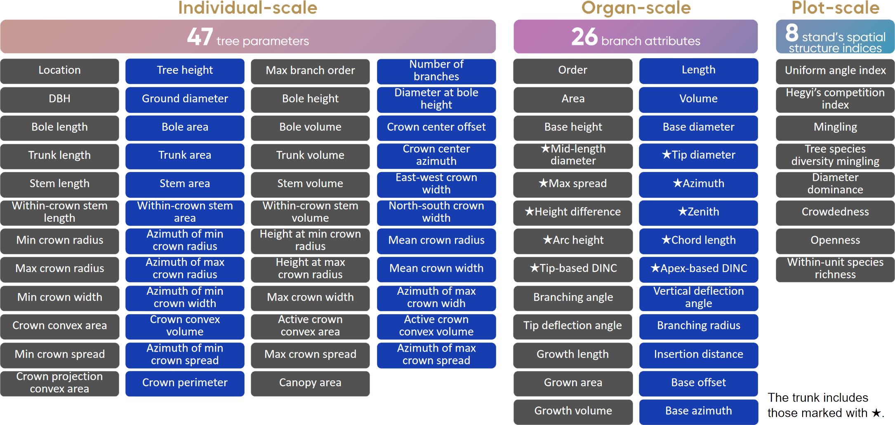

# SmartQSM (Accepted by ISPRS Journal of Photogrammetry and Remote Sensing!)

SmartQSM is a quantitative structure model for individual tree 3D reconstruction and parameter extraction based on point cloud data. It is a part of [Project LiGHTLIN](https://project-lightlin.github.io/).

## GUI

| Real-time processing and displaying | Interactive architectural analysis |
|-------------------------------------|-----------------------------------|
|  |  |

Support the extraction of 81 multiscale parameters including:



You can find the definitions and calculations of these parameters in the [paper](<>).

> **Note:**
>
> This project is under long-term maintenance.
>
> **A major version upgrade is expected to take place in the summer of 2026.**
>
> We would greatly appreciate it if you could contribute code fixes or new features, and mark your contribution among the contributors:) You can open an issue or mail to the author and we will review it as soon as possible!

You can also visit the [repo](https://github.com/project-lightlin/SmartQSM).

## Contributors

- (Author) Dr. YANG Jie, Beijing Forestry University (nj_yang_jie@foxmail.com)

## License

This project is licensed under the [GNU Affero General Public License v3.0 (AGPL-3.0)](https://www.gnu.org/licenses/agpl-3.0.html).

To report potential misuse of this project (e.g., for illegal activities or harassment), please contact [yangtd@ifrit.ac.cn](mailto:yangtd@ifrit.ac.cn) with a detailed description and any supporting evidence. Thank you for helping us make our community a better place!

## Installation and Startup

### 0. Prerequisites

This repo has been verified and tested on Windows 10/11. Linux has not been tested.

1. Please refer to [how-to-install-python-and-deep-learning-libraries](https://project-lightlingithubio.readthedocs.io/en/latest/how-to-install-python-and-deep-learning-libraries.html) to prepare the virtual environment.

2. Install [Git](https://git-scm.com/) and clone the repository by:

```bash
git clone https://github.com/project-lightlin/SmartQSM.git
```

*Or* you can:

A. click the green *Code* button on the top right corner of the repo page,

B. click *Download ZIP*,

C. extract the downloaded zip file to the desired location.

> **Note:**
>
> We strongly recommend that you install [Git](https://git-scm.com/) for future upgrades.

3. Change the working directory of the virtual environment to the project directory (including requirements.txt).

4. Install the required dependencies in the virtual environment:

```bash
pip install -r requirements.txt
```

### 1. Run SmartQSM

```bash
python entrypoints/smartqsm.py
```

*Or* use command-line arguments:

```bash
python entrypoints/smartqsm.py [-h] [-v] [-y] [-c CONFIG] [-t] [CLOUD_PATHS ...]
```

You can refer to the specific parameter descriptions by using the `-h` option.
The default configuration file represented by `CONFIG` is located in the **configs/** directory of the project;
you can select one based on your requirements.
Alternatively, you can create a **.yaml** file with the same name as your input point cloud file in the same directory to achieve personalized reconstruction,
though this requires some programming experience.

Each processed individual-tree point cloud will generate five output files (**\*_active_crown.ply**, **\*_branches.ply**, **\*_crown.ply**, **\*_qsm.mat** and **\*_skeleton.dxf**) in the same directory.

> **Note:**
>
> Use the configuration file marked "cpu" if the PyTorch version in the virtual environment is for CPU; use the configuration file marked "GPU" if the version is "cuXXX".

### 2. Run QSM Viewer: Interactive Architectural Analysis Tool

```bash
python entrypoints/qsm_viewer.py
```

*Or*

```bash
python entrypoints/qsm_viewer.py PATH_OF_YOUR_qsm.mat
```

### 3. Run Parameter Exporter

```bash
python entrypoints/parameter_exporter.py
```

### 4. Run Stand Structurer: Calculation and tabular output tool for stand's spatial structure parameters

```bash
python entrypoints/stand_structurer.py
```

## Known Bugs

1. After running, the window is black and continuously reports errors:

```c++
in void __cdecl filament::PlatformWGL::makeCurrent(struct filament::backend::Platform::SwapChain *,struct filament::backend::Platform::SwapChain *) noexcept:241
reason: wglMakeCurrent() failed. hdc = [Any 16-digit hexadecimal value]

Windows error code: 2000. (null)
```

Visit https://github.com/isl-org/Open3D/issues/3317

2. When running on Linux, it reports `Segmentation fault`.

Visit https://github.com/isl-org/Open3D/issues/6840

3. If automatic upgrades always fail, try replacing `entrypoints/_updater.py` with the latest version in the repo.

## Reference

If the code is helpful for your work, please cite:

```
test
```

## Changelog